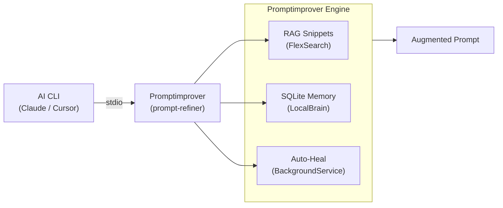

# Promptimprover

[](https://github.com/Coding-Autopilot-System/Promptimprover/actions/workflows/ci.yml)
[](https://nodejs.org/)
[](LICENSE)

Part of the [Coding-Autopilot-System](https://github.com/Coding-Autopilot-System) ecosystem:
[gsd-orchestrator](https://github.com/Coding-Autopilot-System/gsd-orchestrator) | [autogen](https://github.com/Coding-Autopilot-System/autogen)

Promptimprover is an MCP server middleware that intercepts and refines every AI prompt before code generation — applying project context, coding standards, and compounding memory.

## Features

- **RAG neural snippets** — FlexSearch-based retrieval over the local codebase; injects relevant code examples into every prompt
- **Compounding memory** — SQLite-backed pattern store accumulates project-specific rules and standards learned over time
- **Auto-heal middleware** — background file watcher triggers commit ingestion and lesson extraction; keeps context current without manual intervention
- **Context-aware project scouting** — NodeDetector, PythonDetector, and ArchitecturalScout identify tech stack and patterns at startup

## Architecture



## Quickstart

```powershell
git clone https://github.com/Coding-Autopilot-System/Promptimprover.git
cd Promptimprover
.\build_and_install.ps1
```

Add `prompt-refiner` to your MCP client configuration. See the [Setup Guide](https://github.com/Coding-Autopilot-System/Promptimprover/wiki/Setup-Guide) for full configuration instructions.

## License

MIT — see [LICENSE](LICENSE)
