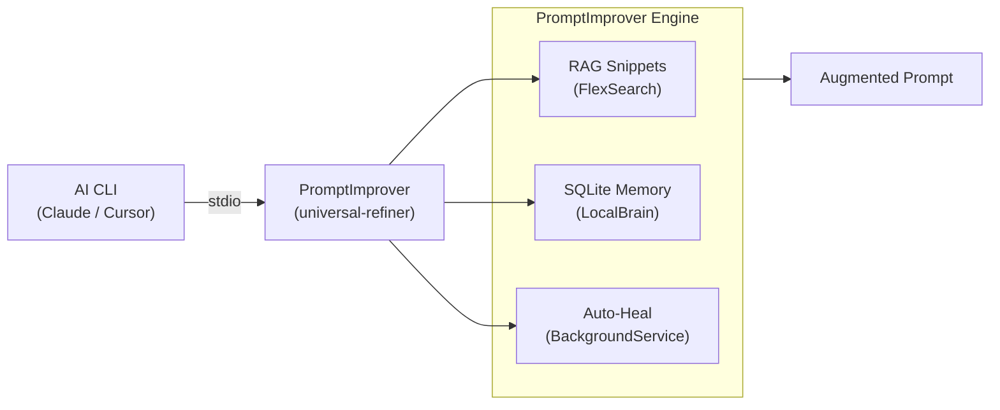

# ?? Promptimprover: MCP-First Prompt Governance


**Promptimprover** is an elite Model Context Protocol (MCP) server that acts as an intelligent prompt governance layer. It intercepts, classifies, and refines raw engineering prompts using deep repository context before they ever reach an LLM, ensuring maximum execution success.

## ?? Elite Features
* **Universal Refiner MCP**: Runs cross-CLI and editor-agnostic via the official MCP specification.
* **Intelligent Governance**: Evaluates raw prompts against past failures and auto-injects missing context.
* **Zero-Knowledge Evidence Engine**: Tracks execution outcomes and uses RLAIF (Reinforcement Learning from AI Feedback) to refine prompts dynamically.

## ? Quickstart
1. Ensure Node 22 is installed.
2. Build the MCP Server:
   \\\ash
   npm install && npm run build
   \\\
3. Link to your MCP client:
   \\\ash
   npm run link-mcp
   \\\

- prompt governance before code execution
- MCP-based integration instead of editor-specific glue
- evidence-backed refinement using history, tests, and repo context

## What It Demonstrates

- **MCP integration**: the active implementation is the `universal-refiner` package, a TypeScript MCP server for cross-CLI prompt refinement
- **Governance pipeline**: prompts can be captured, classified, refined, and linked to execution outcomes instead of being treated as disposable chat
- **Repo-aware context**: detectors, memory, and retrieval components adapt refinement to the current codebase
- **Proof-oriented design**: tests and architecture docs emphasize traceability, learning, and operational visibility rather than prompt rewriting alone

## Features

- **RAG snippets**: FlexSearch-based retrieval over the local codebase to inject relevant examples into prompt refinement
- **Persistent memory**: SQLite-backed storage for reusable rules, learned patterns, and prompt history
- **Context scouting**: detectors identify language, framework, and architectural signals at startup
- **Operational traceability**: history, timelines, and prompt-to-outcome correlation are first-class design goals

## Current Scope vs. Roadmap

The repo contains both implemented components and forward-looking architecture.

- **Implemented now**: the `universal-refiner` MCP server, Gemini-oriented packaging, tests, and install/build scripts
- **Designed for later expansion**: broader routing, portal, and evidence workflows described in the architecture spec

That distinction matters because this repo is about credible system direction, not vague AI middleware claims.

## Architecture Snapshot



## Proof Points

- [Portfolio proof notes](./docs/portfolio-proof.md)
- [Architecture spec](./docs/promptimprover-autogen-architecture-spec.md)
- [Operator testing guide](./docs/operator-testing.md)
- [Enterprise release gates](./docs/enterprise-release-gates.md)
- [`universal-refiner/package.json`](./universal-refiner/package.json)
- [`universal-refiner/tests`](./universal-refiner/tests)

## Quickstart

```powershell
git clone https://github.com/Coding-Autopilot-System/Promptimprover.git
cd Promptimprover
.\build_and_install.ps1
```

On Linux or macOS:

```sh
git clone https://github.com/Coding-Autopilot-System/Promptimprover.git
cd Promptimprover
./build_and_install.sh
```

Both installers perform a deterministic dependency install, run the full test suite, build the package, install it globally, and verify the `universal-refiner` command. Add that command to your MCP client configuration. See the [Setup Guide](https://github.com/Coding-Autopilot-System/Promptimprover/wiki/Setup-Guide) for full configuration instructions.

For optional automatic pre-prompt linting and post-execution recording, see the [cross-CLI automation guide](./docs/cross-cli-automation.md). Claude Code and Gemini CLI expose the required lifecycle hooks. Codex currently requires MCP-first instructions or explicit helper invocation because its hook lifecycle does not transparently intercept each prompt.

## Local Semantic Model

PromptImprover uses a local OpenAI-compatible endpoint before optional MCP sampling. The safe defaults target `http://localhost:9000/v1`, use `gemma3:12b` first, and fall back to `gemma3:1b`. If neither local model nor MCP sampling is available, rule-based refinement continues without semantic output.

Override the defaults per repository with `.universal-refiner.json`:

```json
{
  "semantic": {
    "localEnabled": true,
    "mcpSamplingEnabled": true,
    "baseUrl": "http://localhost:9000/v1",
    "models": ["gemma3:12b", "gemma3:1b"],
    "timeoutMs": 120000,
    "temperature": 0.2,
    "allowNonLoopback": false
  }
}
```

Non-loopback model endpoints are rejected unless `allowNonLoopback` is explicitly enabled. Generated lessons and templates remain pending until reviewed through the MCP learning-review tools.

## License

MIT - see [LICENSE](LICENSE)

<!-- docs-verified: 101f63d702e5c0ab8052c8e0c67a104d8edfbddb 2026-07-08 -->
