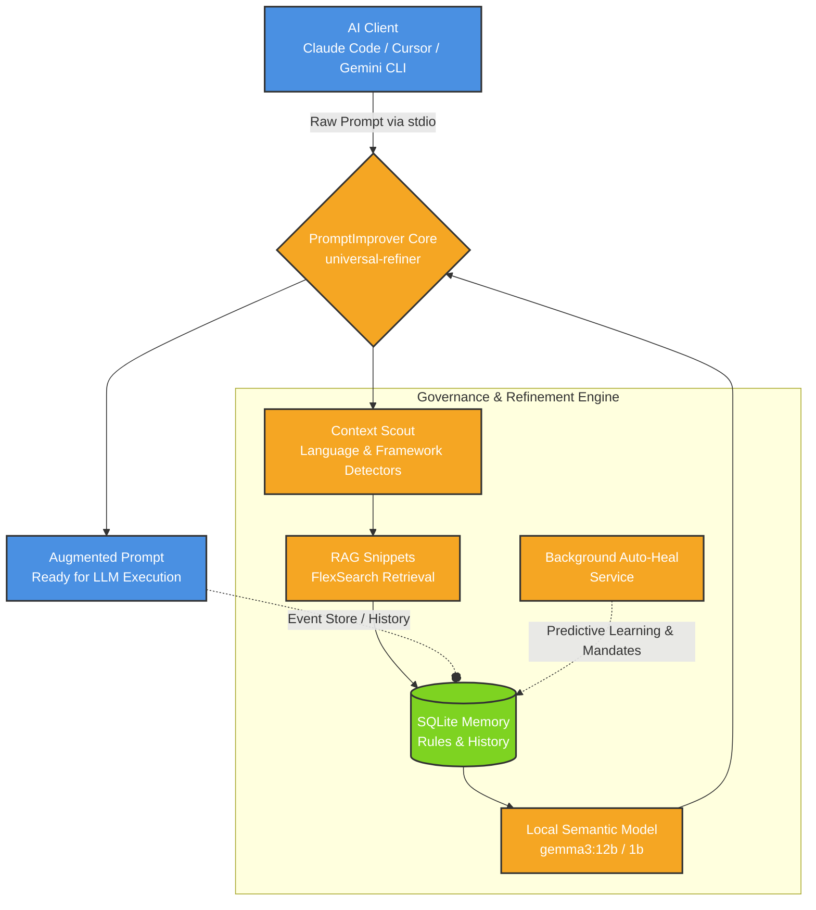

# PromptImprover Architecture

This document outlines the technical architecture and logic of PromptImprover.

## High-Level Design

PromptImprover sits between the AI CLI (e.g., Claude, Cursor, Gemini) and the execution environment. It intercepts prompts, augments them with local repository context, applies governance rules, and records the interaction for future learning.

## Component Breakdown

### 1. Context Scout
At startup, detectors scan the current workspace to identify languages, frameworks, and architectural signals. This ensures the refinement process is strictly tailored to the current codebase.

### 2. RAG Snippets (FlexSearch)
Uses `FlexSearch` to retrieve relevant code snippets, past solutions, and templates from the local repository. This semantic retrieval injects highly relevant examples into the context window before execution.

### 3. LocalBrain (SQLite Memory)
The persistent storage layer. It manages:
- Reusable refinement rules.
- Learned patterns from past executions.
- Prompt history and event store logs.

### 4. Local Semantic Model
An optional OpenAI-compatible local model (e.g., `gemma3:12b`) that processes and refines the prompt based on the collected context before it is finalized. If unavailable, rule-based refinement is used.

### 5. Learning & Auto-Heal
Background services continuously correlate historical commits and agent outputs to derive new engineering mandates, creating a self-improving loop.
