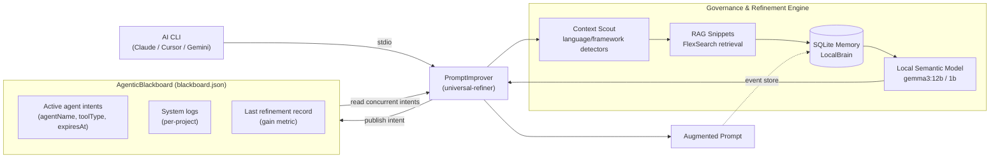

# Architecture

## Governance / blackboard flow

`universal-refiner` (the active MCP server) intercepts a raw prompt from an AI CLI, runs it
through context and refinement, and — via `AgenticBlackboard` (`src/core/blackboard.ts`) —
publishes and reads shared state so concurrent agent sessions can coordinate rather than act
on disjoint local knowledge.

<!-- codex:generate-image prompt="A shared glowing chalkboard in the center of a room, with several small agent robots (labeled Claude, Cursor, Gemini) posting colored intent cards onto it and reading each other's cards before acting; one robot writes a refined prompt scroll that flows out to a waiting execution robot; isometric, enterprise blue/graphite palette" style="isometric, enterprise, clean" replaces="mermaid-above" -->

## Component breakdown

- **Context Scout** — startup detectors identify language, framework, and architectural
  signals so refinement is tailored to the current codebase (`src/detectors/project-scout.ts`).
- **RAG Snippets** — FlexSearch-based retrieval over the local codebase injects relevant
  examples into the refined prompt.
- **AgenticBlackboard** — a JSON-file-backed shared store (`.refiner/blackboard.json`,
  project-scoped, with a global fallback under `~/.refiner`) recording active agent intents
  (`agentName`, `toolType`, `intent`, `expiresAt`), system logs, and the last refinement's
  gain metric. A serialized write queue (`writeQueue`) and listener registry prevent
  concurrent-write corruption when multiple CLI sessions touch the same project.
- **LocalBrain (SQLite)** — persistent storage for reusable refinement rules, learned
  patterns, and prompt history.
- **Local Semantic Model** — an optional OpenAI-compatible local endpoint (`gemma3:12b`,
  falling back to `gemma3:1b`) that produces the final refined prompt; rule-based refinement
  continues if neither the local model nor MCP sampling is available.
- **Governance gate** — generated lessons and templates remain pending until reviewed through
  the MCP learning-review tools (see the root README's Local Semantic Model section) — the
  blackboard records the intent and history that gate reviews against.

<!-- docs-verified: 101f63d702e5c0ab8052c8e0c67a104d8edfbddb 2026-07-08 -->
